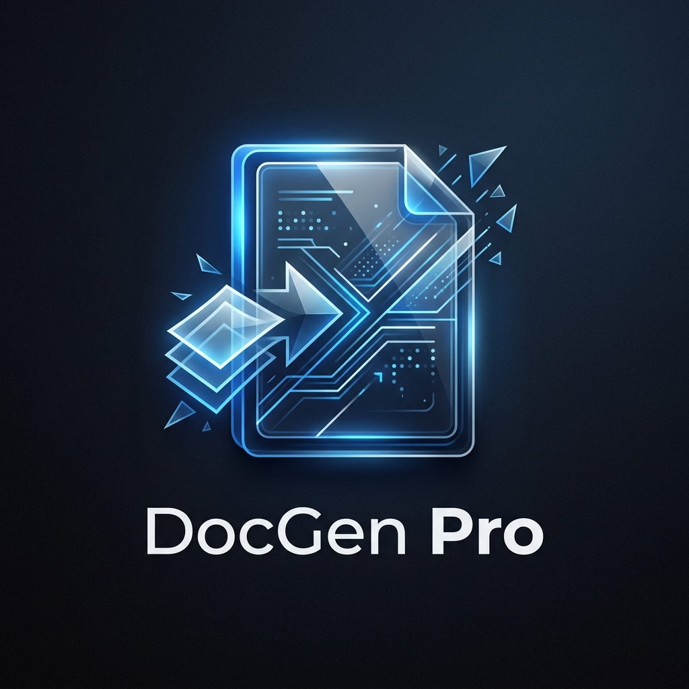

<div align="center">
  
  <h1>DocGen Pro v2.0</h1>
  <p><i>A próxima geração em automação de documentos Word e PDF</i></p>
  
  <br />
  
  
  
  <br />
  <br />

  <p>
    
    
    
    
  </p>
</div>

---

<div align="center">
  
  
</div>

---

## 🚀 Visão Geral

O **DocGen Pro** é uma solução desktop de alta performance projetada para revolucionar o fluxo de trabalho de departamentos jurídicos, administrativos e comerciais. Ele automatiza a criação de documentos complexos em Word (`.docx`) e PDF, eliminando erros manuais e economizando horas de trabalho repetitivo.

Com o DocGen Pro, você transforma modelos estáticos em formulários dinâmicos e inteligentes.

---

## 💎 Destaques da Versão 2.0

> [!TIP]
> A versão 2.0 foca em colaboração e produtividade em escala.

*   **Banco de Dados Flexível & Concorrente**: Sistema exclusivo de bloqueio (`database.lock`) que permite o uso em pastas compartilhadas (Cloud/Rede) sem conflitos.
*   **Gestão de Acessos (RBAC)**: Três níveis de permissão (`admin`, `manager`, `user`) para garantir a segurança dos seus dados e modelos.
*   **Geração Inteligente em Lote**: Processamento de centenas de documentos a partir de planilhas Excel/CSV com mapeamento automático de colunas.
*   **Nomenclatura Dinâmica**: Utilize variáveis do próprio documento para compor o nome dos arquivos gerados.

---

## ✨ Funcionalidades Principais

| Funcionalidade | Descrição |
| :--- | :--- |
| **Geração Individual** | Interface intuitiva para preenchimento de campos e geração instantânea. |
| **Geração em Lote** | Importação direta de Excel com suporte a centenas de registros simultâneos. |
| **Exportação PDF** | Conversão nativa integrada para envio imediato de documentos finais. |
| **Biblioteca de Ativos** | Armazene logotipos, assinaturas e carimbos para inserção automática. |
| **Dicionário de Variáveis** | Adicione descrições e dicas (tooltips) para facilitar o preenchimento por novos usuários. |
| **Máscaras de Dados** | Validação em tempo real para CPF, CNPJ, Datas e Moeda. |
| **Sistema de Backup** | Backup automatizado do banco de dados e ativos em um clique. |
| **Interface Moderna** | Suporte total a temas Dark e Light com alta fidelidade visual. |

---

## 🛠️ Stack Tecnológica

*   **Linguagem**: [Python 3.13](https://www.python.org/)
*   **Interface Gráfica**: [CustomTkinter](https://github.com/TomSchimansky/CustomTkinter) (Visual Moderno)
*   **Processamento de Dados**: [Pandas](https://pandas.pydata.org/)
*   **Manipulação de Word**: `python-docx` & `mammoth`
*   **Motor de PDF**: `xhtml2pdf`
*   **Persistência**: SQLite com mecanismo de Lock customizado

---

## 📥 Instalação e Configuração

### Pré-requisitos
*   Python 3.13 ou superior instalado.
*   Pip (gerenciador de pacotes).

### Passo a Passo

1.  **Clonar ou Baixar o Projeto**:
    ```bash
    git clone https://github.com/seu-usuario/GenerateDocuments.git
    cd GenerateDocuments
    ```

2.  **Configurar Ambiente Virtual**:
    ```bash
    python -m venv venv
    source venv/bin/activate  # No Linux/Mac
    # venv\Scripts\activate   # No Windows
    ```

3.  **Instalar Dependências**:
    ```bash
    pip install -r requirements.txt
    ```

4.  **Iniciar a Aplicação**:
    ```bash
    python main.py
    ```

> [!IMPORTANT]
> **Credenciais Padrão**:
> 
> **Usuário**: `admin` | **Senha**: `admin`

---

## 📂 Organização do Projeto

```text
├── main.py                     # Ponto de entrada da aplicação
├── database.py                 # Lógica de banco de dados e controle de concorrência
├── requirements.txt            # Lista de dependências do Python
├── assets/                     # Recursos visuais (imagens, ícones, logos)
├── gui/                        # Componentes da interface do usuário
│   ├── login.py                # Autenticação
│   ├── dashboard.py            # Navegação principal
│   ├── document_generator.py   # Núcleo de geração (Single & Bulk)
│   └── ...                     # Gerenciadores de usuários, modelos e ativos
├── utils/                      # Scripts auxiliares e parser de documentos
└── templates_dir/              # Pasta padrão para armazenamento de modelos .docx
```

---

## 🔒 Segurança e Colaboração

O sistema implementa uma camada de proteção para uso em rede:
- **Lock Ativo**: Ao escrever no banco, o sistema cria um `database.lock`. Outras instâncias ficam em modo de leitura até a liberação.
- **Hierarquia de Grupos**:
    - **User**: Gera documentos.
    - **Manager**: Gerencia modelos e usuários comuns.
    - **Admin**: Controle total, incluindo acesso a configurações e privilégios.

---

## 🛡️ Licença e Suporte

**Este projeto é de uso interno.** Todos os direitos reservados.
Para suporte ou sugestões, entre em contato com o administrador do sistema.