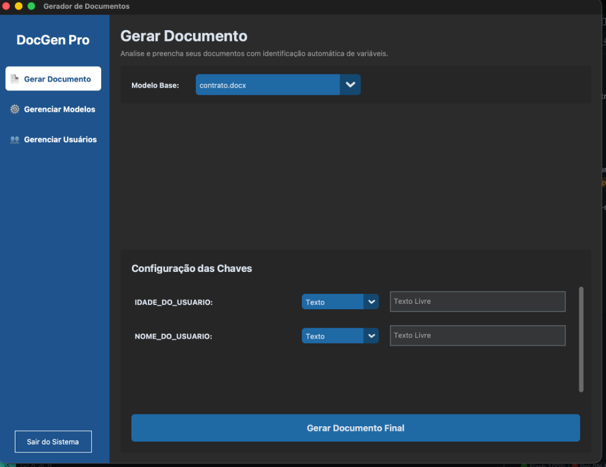

# 📄 DocGen Pro v1.0 - Automação Profissional de Documentos

<div align="center">
  
  
</div>

O **DocGen Pro** é um software desktop de alta performance desenvolvido em Python para automação completa de documentos Word (`.docx`) e PDF. Ideal para departamentos jurídicos, administrativos e comerciais que lidam com fluxos repetitivos de contratos, declarações e relatórios.


---

## 🌟 Destaques e Funcionalidades
O sistema oferece uma suíte completa de produtividade:

- **⚡ Geração em Lote:** Importe planilhas **Excel ou CSV** e gere centenas de documentos personalizados de uma só vez (automação via Pandas).
- **📄 Exportação PDF Integrada:** Conversão nativa e independente (sem necessidade de Word instalado no Mac) via Mammoth e xhtml2pdf.
- **🖼️ Biblioteca de Ativos:** Gerencie uma galeria de **Assinaturas e Logotipos** para inserção rápida em qualquer campo de imagem.
- **🛠️ Inteligência de Campos:**
  - **Máscaras de Entrada:** Formatação automática para CPF, CNPJ e Datas.
  - **Dicionário de Variáveis (Tooltips):** Guarde descrições e lembretes (❓) para cada variável do seu modelo.
- **🌙 Experiência Personalizada:** Alternador de tema **Dark/Light** nativo com persistência de escolha.
- **🛡️ Segurança de Dados:** Sistema de **Backup Local (ZIP)** do banco de dados e arquivos de imagem.

---

## 🛠 Tecnologias
- **Linguagem:** Python 3.13
- **Interface:** CustomTkinter (Design Moderno & Responsivo)
- **Processamento de Texto:** `python-docx` + `mammoth`
- **Geração de PDF:** `xhtml2pdf`
- **Banco de Dados:** SQLite3 (Persistência de usuários, imagens e cache de formulários)
- **Análise de Dados:** `pandas` (para processamento de planilhas em lote)

---

## 📥 Instalação e Setup

### 1. Pré-requisitos (macOS/Linux)
Certifique-se de ter o Python 3 instalado. Recomendamos o uso de ambiente virtual (venv). Se estiver no macOS via Homebrew:
```bash
brew install python-tk@3.13
```

### 2. Configuração do Ambiente
```bash
# Clone o projeto e entre na pasta
# Crie e ative o ambiente virtual
python -m venv venv
source venv/bin/activate

# Instale as dependências
pip install -r requirements.txt
```

---

## 📂 Como Usar

1. **Inicie o Sistema:** `python main.py`
2. **Login Inicial:** Acesse com `admin` / `admin`.
3. **Configure seus Modelos:**
   - Adicione um arquivo `.docx` em **Gerenciar Modelos**. Use chaves como `{nome_cliente}` ou `{data}` no seu arquivo Word.
4. **Alimente a Biblioteca:**
   - Salve suas assinaturas oficiais na aba **Biblioteca de Imagens**.
5. **Gere Documentos:**
   - **Individual:** Escolha o modelo, preencha as variáveis (use as máscaras automáticas!) e clique em Gerar.
   - **Em Lote:** Clique em "⚡ Geração em Lote" e selecione um Excel com colunas que tenham os mesmos nomes das suas variáveis no Word.

---

## 📁 Estrutura do Projeto
```text
/
├── main.py                     # Inicializador do sistema
├── database.py                 # Core de persistência e lógica de backup
├── requirements.txt            # Dependências atualizadas v2.0
├── gui/
│   ├── login.py                # Tela de acesso (transparente/moderna)
│   ├── dashboard.py            # Estrutura principal e sidebar
│   ├── document_generator.py   # Motor de geração (Individual/Lote/PDF)
│   ├── template_manager.py     # Gestão de arquivos .docx
│   ├── user_management.py      # Gestão de operadores do sistema
│   └── image_library.py        # Galeria de assinaturas e logotipos
├── utils/
│   └── docx_parser.py          # Lógica de injeção no Word e conversão PDF
└── assets/                     # Imagens de fundo e branding da aplicação
```

---

## 🛡️ Licença
Este software é de uso interno para automação de documentos. Todos os direitos reservados.
